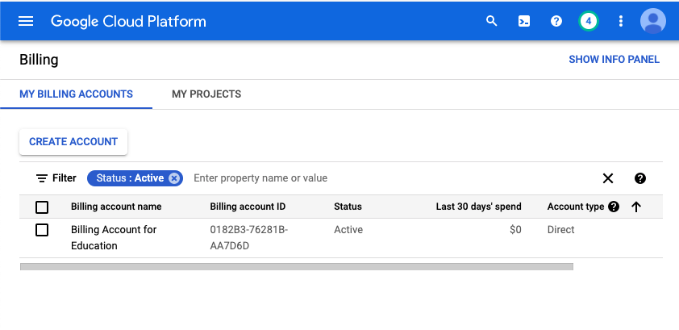

## Activación de cuenta en GCP y control de gasto

Antes de comenzar con la gestión y operación de una plataforma cloud vamos a activar nuestra cuenta en GCP mediante el *Free Trial* (300 USD de crédito durante 90 días) y, antes de crear ningún recurso, vamos a dejar configuradas las alertas de gasto. Controlar el coste es una tarea básica de cualquier administrador de sistemas en la nube, y forma parte de esta práctica.

### Objetivos

- Activar una cuenta de Google Cloud con el *Free Trial*.
- Configurar un presupuesto con alertas de gasto.
- Aprender qué recursos siguen generando coste y cómo comprobarlo.

### Antes de empezar

La tarjeta solo se usa para verificar la identidad. Mientras la cuenta siga en modo *Free Trial*, Google no cobra nada: si se agota el crédito o pasan los 90 días, la cuenta se cierra sola y los recursos se detienen ([FAQ oficial](https://cloud.google.com/signup-faqs?hl=en)).

> **Regla de oro: nunca pulsar "Activar cuenta completa" / "Upgrade".** Es la única forma de acabar pagando. Tras actualizar, Google cobra en la tarjeta todo lo que exceda el crédito y el Free Tier ([documentación oficial](https://docs.cloud.google.com/free/docs/free-cloud-features)). La consola lo sugiere a menudo; lo ignoraremos siempre.

Requisitos:

- **Elegibilidad.** Solo puede activar el *Free Trial* quien nunca haya pagado por Google Cloud, Google Maps Platform o Firebase y no lo haya usado antes.
- **Cuenta de Google personal (Gmail).** Las cuentas institucionales pueden tener Google Cloud restringido.
- **Tarjeta de pago.** Usaremos una tarjeta de crédito o débito normal. Las tarjetas virtuales o prepago pueden hacer que Google rechace la verificación o pida un prepago. Si nuestro banco emite sus tarjetas virtuales como tarjetas de crédito o débito normales, podemos usar una con límite bajo para acotar cualquier cargo.
- **Momento del alta.** Los 90 días empiezan a contar desde el registro, así que activaremos la cuenta al empezar este bloque de prácticas, no antes.

### Parte 1. Activación del Free Trial

1. Entramos en [console.cloud.google.com](https://console.cloud.google.com) con nuestra cuenta personal y pulsamos **Empieza gratis** / **Activar prueba gratuita**.
2. País: España. Tipo de cuenta: **Particular**. Aceptamos las condiciones; no es necesario marcar la casilla de *Email Updates*.
3. Introducimos los datos de la tarjeta. Google hará una retención pequeña de verificación que se libera sola; si a los 14 días sigue pendiente, hay que consultar con el banco.

   Si Google pide un **prepago** (por ejemplo, 25 €), no lo pagamos: comprobamos que la dirección coincide con la de la tarjeta, desactivamos cualquier VPN y probamos con otra tarjeta. Si persiste, abrimos un caso con el soporte de facturación de Google Cloud, que es gratuito.

4. Al terminar, la consola muestra el crédito disponible y los días restantes. Si en algún momento vemos un botón de **Activar cuenta completa**, **no lo pulsamos**.
5. Creamos un proyecto para la asignatura con el nombre `asr-<usuario>`.
6. Comprobamos en <https://console.cloud.google.com/billing> que la cuenta de facturación es de tipo *Prueba gratuita* y que el proyecto está vinculado a ella:



### Parte 2. Presupuesto y alertas de gasto

Vamos a crear un presupuesto de 50 € con alertas por correo, calculado sobre el coste bruto (sin descontar créditos). Los presupuestos **avisan, pero no detienen el gasto**: somos nosotros quienes debemos reaccionar cuando llega una alerta.

1. Vamos a **Facturación > Presupuestos y alertas > Crear presupuesto**.
2. **Nombre:** `asr-presupuesto`. **Periodo:** mensual. **Proyectos:** el de la asignatura.
3. **Créditos:** desmarcamos *Promociones y otros* (y *Descuentos*). Es imprescindible: en el *Free Trial* todo se paga con crédito promocional, y si no lo excluimos el presupuesto marcará siempre 0 € y nunca saltará una alerta.
4. **Importe:** importe especificado, 50 €.
5. **Umbrales:**

| Umbral | Tipo | Para qué sirve |
| --- | --- | --- |
| 25 % (12,50 €) | Real | Primer aviso: revisar qué tenemos encendido |
| 50 % (25 €) | Real | Algo está consumiendo más de lo previsto |
| 90 % (45 €) | Real | Parar y borrar recursos |
| 100 % (50 €) | Previsto | Aviso anticipado según la tendencia del mes |

6. **Notificaciones:** dejamos marcado el correo a administradores de facturación.
7. Guardamos y revisamos en **Facturación > Informes** que el gasto aparece desglosado por servicio.

Los datos de facturación llegan con varias horas de retraso, así que una alerta puede saltar tarde. No sustituye a apagar los recursos al terminar cada sesión.

### Parte 3. Buenas prácticas durante el curso

Al acabar cada sesión borraremos lo que hayamos creado. Detener no siempre basta: varios recursos siguen cobrando aunque no los usemos.

| Recurso | Qué sigue cobrando | Qué hacer al terminar |
| --- | --- | --- |
| VM de Compute Engine | El disco, aunque la VM esté detenida | Borrar la VM y sus discos |
| IP externa estática | La IP reservada, sobre todo si no está en uso | Liberar la dirección |
| Clúster de GKE | Los nodos y los balanceadores que creen los Services | Borrar el clúster completo |
| Balanceador de carga | Las reglas de reenvío, por hora | Borrarlo junto con sus backends |
| Cloud NAT / Cloud SQL | Por hora mientras existan | Borrarlos |

Comprobaciones rápidas desde Cloud Shell:

```bash
gcloud compute instances list
gcloud compute disks list
gcloud compute addresses list
gcloud container clusters list
gcloud compute forwarding-rules list
```

Si todas devuelven vacío, no estamos gastando en esos servicios. Conviene revisar **Facturación > Informes** una vez por semana.

Al terminar el curso borraremos el proyecto con `gcloud projects delete $PROJECT_ID` (queda 30 días pendiente de eliminación y después se borra definitivamente). No hace falta cancelar el *Free Trial*: se cierra solo al agotar el crédito o a los 90 días.
