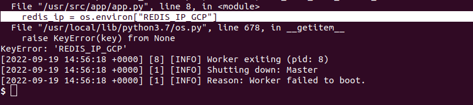

### Introducción

En el siguiente ejemplo vamos a profundizar un poco más en la automatización de los
despliegues de aplicaciones (interconectadas) mediante `gcloud`. En este proceso vamos a
introducir también algunos de los 12-factores (12F) que deben componer una aplicación
*nativa cloud* (*cloud native* en inglés), e.g., declarar todas las dependencias en un
manifiesto, en nuestro caso [requirements.txt](requirements.txt).

### Previo

- Instalar Docker en tu entorno de trabajo (WSL2/Linux/Mac). Si usas Ubuntu/WSL2 puedes
  seguir la [guía oficial de instalación de Docker Engine](https://docs.docker.com/engine/install/ubuntu/).
- Tener ya creado y seleccionado el proyecto de la práctica 4 (ver
  [01. google-primerospasos](../01.%20google-primerospasos/README.md)).

### La aplicación

Se trata de una aplicación sencilla escrita
en `python` (con `Flask`) la cual actúa como interfaz de comunicación con una
base de datos `Redis`, ambos dos servicios desplegados en GCP. La idea es que la
aplicación `Flask` exponga:

- Método `POST` en el path `/`, que admita cargas `JSON` del tipo `{"name": "myName"}`
  que serán guardadas como entradas en la base de datos

- Método `GET` en el path `/`, que mostrará todos los registros guardados en la base
  de datos

- Método `POST` en el path `/reset`, que borrará la base de datos y mostrará
  el índice a posteriori (que estará en blanco)

El código de la App está compuesto por los ficheros:

- [app.py](app.py): Código Python de la aplicación
- [requirements.txt](requirements.txt): Manifiesto de las dependencias necesarias
- [Dockerfile](Dockerfile) y [entrypoint.sh](entrypoint.sh): Contenerización de la aplicación

### 1. Configurar la región y zona por defecto

Para no tener que repetir `--region`/`--zone` en cada comando:

```shell
gcloud config set compute/region europe-southwest1
gcloud config set compute/zone europe-southwest1-b
```

### 2. Habilitar Artifact Registry y crear el repositorio Docker

Solo hace falta la primera vez:

```shell
gcloud services enable artifactregistry.googleapis.com
gcloud artifacts repositories create asr-registry \
    --repository-format=docker \
    --location=europe-southwest1 \
    --description="Repo docker practica 4"
gcloud auth configure-docker europe-southwest1-docker.pkg.dev --quiet
```

### 3. Calcular la URI de la imagen de la app

Vamos a reutilizar esta URI en varios comandos (`build`, prueba local, `push` y
despliegue), así que la guardamos en una variable:

```shell
export APP_IMAGE="europe-southwest1-docker.pkg.dev/$(gcloud config get-value project)/asr-registry/asr-flask"
```

### 4. Desplegar la VM de Redis

⚠️ Google ha discontinuado `gcloud compute instances create-with-container` (el
*container startup agent*): ya no se puede usar para crear VMs nuevas. En su lugar,
creamos una VM con **Container-Optimized OS** (trae Docker preinstalado) y le pasamos
un *startup script* que lanza el contenedor.

Redis estará sirviendo a través del puerto (TCP) `6379`:

```shell
gcloud compute instances create redis-server \
    --machine-type=e2-small \
    --image-family=cos-stable \
    --image-project=cos-cloud \
    --tags=redis-server \
    --metadata=startup-script='#! /bin/bash
docker run -d --restart=always --name redis -p 6379:6379 redis:latest'
```

Vamos a necesitar el nombre de esta VM (`redis-server`) más adelante para consultar
su IP y para borrarla al final, así que la guardamos también en una variable:

```shell
export REDIS_VM=redis-server
```

### 5. Obtener la IP interna de Redis

La App se va a conectar a Redis por la red interna del proyecto (no hace falta IP
pública en la VM de Redis):

```shell
export REDIS_VM_IP=$(gcloud compute instances describe $REDIS_VM \
    --format='get(networkInterfaces[0].networkIP)')
```

### 6. Contenerizar la aplicación

Construimos la imagen (`docker build`), pasándole como argumento de construcción la IP
de Redis obtenida en el paso anterior, de manera que la App pueda establecer la
conexión con ésta:

```shell
docker build --tag $APP_IMAGE \
    --build-arg REDIS_IP=$REDIS_VM_IP \
    .
```

Antes de subir la imagen al registry de Google, vamos a probar que nuestra imagen
corre correctamente con docker:

```shell
docker run $APP_IMAGE
```



¿Qué error da? ¿Por qué puede ser este error? ¿Cómo habría que corregirlo?

```shell
docker run -p 6379:6379 redis
docker run -e REDIS_IP_GCP=host.docker.internal -p 5000:5000 --add-host=host.docker.internal:host-gateway asr-flask:v.0.0.1
```

### 7. Publicar la imagen en Artifact Registry

```shell
docker push "$APP_IMAGE"
```

### 8. Desplegar la VM de la aplicación

Igual que con Redis, usamos Container-Optimized OS con un *startup script*. Como esta
vez la imagen es privada (está en nuestro Artifact Registry), añadimos
`--scopes=cloud-platform` para que la VM pueda autenticarse, y configuramos las
credenciales de Docker con `docker-credential-gcr` antes de hacer el `docker run`.

⚠️ En COS el filesystem raíz es de solo lectura, así que `docker-credential-gcr` no
puede escribir su configuración en `$HOME` si el *startup script* se ejecuta con
`HOME=/root` (el valor por defecto). Apuntamos `HOME` a `/home`, que sí es escribible.

⚠️ Además, la cuenta de servicio por defecto de Compute Engine ya no recibe el rol
`Editor` automáticamente en proyectos nuevos, así que aunque la VM tenga el *scope*
`cloud-platform` no podrá leer del Artifact Registry hasta que le demos permiso
explícito (solo hace falta una vez por proyecto):

```shell
PROJECT_NUMBER=$(gcloud projects describe $(gcloud config get-value project) --format='value(projectNumber)')
gcloud projects add-iam-policy-binding $(gcloud config get-value project) \
    --member="serviceAccount:${PROJECT_NUMBER}-compute@developer.gserviceaccount.com" \
    --role="roles/artifactregistry.reader"
```

```shell
gcloud compute instances create asr-flask-app \
    --machine-type=e2-small \
    --image-family=cos-stable \
    --image-project=cos-cloud \
    --tags=app-server \
    --scopes=cloud-platform \
    --metadata=startup-script="#! /bin/bash
export HOME=/home/startup
mkdir -p \$HOME
docker-credential-gcr configure-docker --registries=europe-southwest1-docker.pkg.dev
docker run -d --restart=always --name asr-flask -p 8080:8080 -e REDIS_IP_GCP=$REDIS_VM_IP $APP_IMAGE"
```

Igual que con Redis, guardamos el nombre de la VM para poder borrarla luego:

```shell
export APP_VM=asr-flask-app
```

### 9. Crear las reglas de firewall

Necesitamos dos reglas: una para que tú (desde tu IP) puedas llegar a la App por el
puerto `8080`, y otra para que la App (VM con tag `app-server`) pueda llegar a Redis
por el puerto `6379` (Redis no debe quedar expuesto a internet, solo a la App):

```shell
gcloud compute firewall-rules create "default-allow-onlymyip-8080" \
    --direction=INGRESS \
    --priority=1000 \
    --network=default \
    --action=ALLOW \
    --rules=tcp:8080 \
    --source-ranges=$(curl ifconfig.me) \
    --target-tags=app-server

gcloud compute firewall-rules create "allow-server-to-redis-6379" \
    --direction=INGRESS \
    --priority=1001 \
    --network=default \
    --action=ALLOW \
    --rules=tcp:6379 \
    --source-tags=app-server \
    --target-tags=redis-server
```

⚠️ Recuerda que para probar la App en el navegador hay que forzar `http://`
(ver la práctica 01): si dejas que el navegador use `https://` por defecto, no
conectará porque no hemos abierto el puerto `443`.

### Liberación de los recursos

Para evitar incurrir en gastos innecesarios que acabarían con nuestros créditos
gratuitos, borramos las dos VMs y las dos reglas de firewall que hemos creado:

```shell
gcloud compute instances delete $APP_VM $REDIS_VM --quiet
gcloud compute firewall-rules delete default-allow-onlymyip-8080 allow-server-to-redis-6379 --quiet
```

#### 🔹 Ejemplos con `curl`

```bash
#Añadir estudiante:
curl -X POST http://localhost:8080/ \
     -H "Content-Type: application/json" \
     -d '{"name": "Alice"}'

#Añadir otro estudiante:
curl -X POST http://localhost:8080/ \
     -H "Content-Type: application/json" \
     -d '{"name": "Bob"}'

#Listar estudiantes:
curl http://localhost:8080/

#Resetear lista de estudiantes:
curl -X POST http://localhost:8080/reset

#Resetear lista y añadir estudiante en un solo paso:
curl -X POST http://localhost:8080/reset \
     -H "Content-Type: application/json" \
     -d '{"name": "Charlie"}'
```
