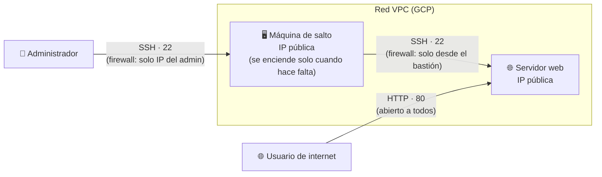
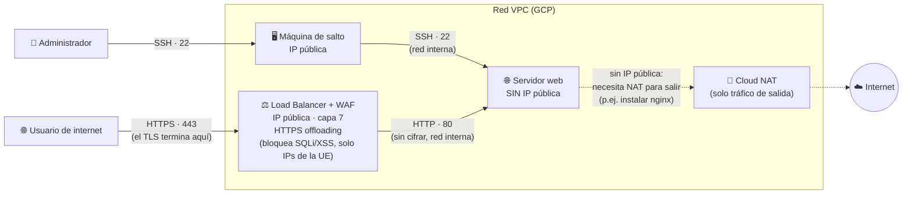
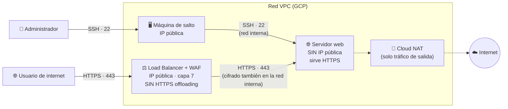

Crear una máquina expuesta directamente a internet es un gran problema de seguridad. Algunas reglas de seguridad que vamos a aplicar en esta práctica son:
- Regla del mínimo privilegio.
- Exponer únicamente lo mínimo imprescindible a internet.
- Usar siempre tráfico cifrado (siempre en internet)
- Usar siempre un doble salto para un acceso a un servidor si este está expuesto a internet

Partiendo de la práctica 4, la versión desplegada en Google, es necesario realizar las siguientes evoluciones (por cada punto adjuntar evidencia en un documento PDF)
## 1a Solución: creación de máquina de salto - 4 puntos
- Montar una máquina de salto para poder acceder a nuestro servidor web. Esta máquina se debería encender y apagar cada vez que se quiera modificar algo del servidor web.
- Exponer únicamente en ambos servidores lo mínimo indispensable con reglas de firewall (firewall capa 4).

Fíjate en que el servidor web ya **no** admite SSH desde cualquier IP: la regla de
firewall de capa 4 solo debe permitir el puerto `22` con origen la IP (o el *tag*) de
la máquina de salto, y el puerto `80` abierto al resto del mundo.

## 2da mejora solución: introducción a los WAF - Web Application Firewall (firewall capa 7) - 4 puntos
- Convertir nuestro servidor web para que no tenga ip pública, y montar un balanceador con servicio de WAF haciendo HTTPS offloading. ¿Qué ventajas e incovenientes tiene hacer https offloading en el balanceador? ¿Qué pasos adicionales has tenido que hacer para que la máquina pueda salir a internet para poder instalar el servidor nginx?
- Proteger nuestra máquina de ataques SQL Injection, Cross Syte Scripting y restringir el tráfico sólo a paises de confianza de la UE implantando un WAF a nuestro balanceador.

El servidor web deja de tener IP pública, así que ya no se puede llegar a él ni por
SSH ni por HTTP directamente desde fuera: todo el tráfico entra por el balanceador. Al
quitarle la IP pública, tampoco puede salir por sí solo a internet (por ejemplo, para
instalar `nginx` la primera vez): de ahí que haga falta un **Cloud NAT**, que da salida
a internet sin necesidad de una IP pública en la propia VM.

## 3ra mejora solución: zero trust - 1 punto
- Cifrar el contenido web también dentro del cloud y quitar el HTTPS offloading.

La diferencia con la solución anterior es un solo salto: ahora el balanceador ya no
descifra el tráfico (no hace *HTTPS offloading*), sino que lo reenvía (o lo vuelve a
cifrar) hacia el servidor web por HTTPS, de forma que el tráfico va cifrado en **todo**
el trayecto, incluida la red interna del cloud — el principio de *zero trust*: no
confiar en que la red interna es "segura por defecto".

## 4ta mejora solución - 1 punto
¿Qué otras mejoras se te ocurrirían para mejorar la seguridad o disponibilidad del servidor web? (No hace falta implementarlas)
