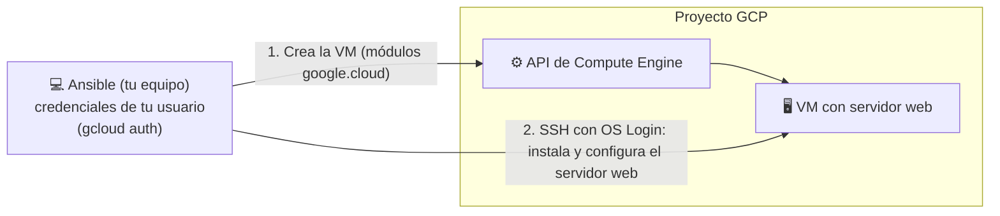

## Introducción
Ansible es una herramienta utilizada principalmente para el aprovisionamiento y la gestión de la configuración. Con la ayuda de los módulos de GCP en Ansible, podemos realizar las tareas en GCP usando Ansible.

En esta práctica vamos a realizar el aprovisionamiento de la instancia de Google VM Compute en GCP y alojamiento de un sitio web (apache) en esta instancia creada.

## Diseño



## 1. Autenticación con tu propio usuario (sin service accounts)

No vamos a crear ninguna service account ni a descargar claves `.json`: Ansible usará
las credenciales de **tu propio usuario** de Google, igual que hacemos con Terraform.

```shell
gcloud auth login                         # para los comandos gcloud
gcloud auth application-default login     # credenciales que usarán los módulos de Ansible
gcloud config set project <tu-proyecto>
gcloud config set compute/region europe-west1
gcloud config set compute/zone europe-west1-b
```

En los módulos de `google.cloud` esto se indica con `auth_kind: application`, que usa
las credenciales generadas por `gcloud auth application-default login`.

## 2. Acceso SSH a la VM con OS Login

Para que Ansible pueda entrar por SSH en la VM que cree, usaremos **OS Login** con tu
propio usuario. Necesitarás, en este orden:

1. Activar OS Login a nivel de proyecto mediante metadata
   (`gcloud compute project-info add-metadata --metadata enable-oslogin=TRUE`).
2. Generar un par de claves SSH (`ssh-keygen`) y asociar la clave pública a tu usuario
   mediante el comando de OS Login correspondiente (`gcloud compute os-login ssh-keys add ...`).
3. Averiguar el nombre de usuario POSIX que OS Login te ha asignado (lo necesitarás para
   que Ansible se conecte por SSH):
   ```shell
   gcloud compute os-login describe-profile --format='value(posixAccounts[0].username)'
   ```
4. Comprobar que todo lo anterior está correctamente configurado (`gcloud config list`).

## 3. Revisión de la plantilla que vamos a lanzar

Los módulos de GCP para Ansible viven en la colección `google.cloud`, que no viene
instalada por defecto. Instálala antes de nada:

```shell
ansible-galaxy collection install google.cloud
pip install google-auth
```

Estructura del directorio del proyecto que deberás preparar:
```shell
$ tree
.
├── main.yml
└── roles
    └── simple-web
        ├── files
        │   └── index.html
        └── tasks
            └── main.yml

4 directories, 3 file
```

Deberás crear el playbook de Ansible con, al menos:

- **`main.yml`** (playbook principal), con dos *plays*:
  1. Un primer *play* sobre `localhost` que cree una instancia de Compute Engine en GCP
     (módulo `google.cloud.gcp_compute_instance`), con disco de arranque, imagen a tu elección, red por
     defecto con IP pública, y las `tags` necesarias para permitir tráfico HTTP/HTTPS y
     SSH externo. A continuación, debe esperar a que la VM esté en estado `RUNNING`
     (módulo `google.cloud.gcp_compute_instance_info` con `until`/`retries`/`delay`) y guardar su IP
     pública como host para el siguiente *play* (`add_host`).
  2. Un segundo *play* sobre el grupo de hosts anterior, que aplique el rol
     `simple-web` para instalar y arrancar un servidor web con una página propia.

- **`roles/simple-web/tasks/main.yml`**: tareas para instalar el paquete del servidor web
  (usa el módulo adecuado según el sistema operativo elegido), copiar el/los fichero(s)
  de tu sitio web, y asegurar que el servicio está arrancado.

- **`roles/simple-web/files/index.html`**: tu propia página de bienvenida.

Piensa qué variables conviene parametrizar al principio del playbook (proyecto,
región/zona, tipo de máquina, imagen...) para no tener que
tocar el resto del fichero cuando cambien.

## 4. Ejecutando el Ansible
El paso final para resumir todo el código es ejecutar el playbook de ansible contra tu
proyecto, conectándote por SSH con tu usuario POSIX de OS Login (paso 2) y tu clave
privada:

```shell
ansible-playbook main.yml -u <usuario_posix> --private-key ~/.ssh/<tu_clave>
```

Si el comando falla, revisa que tengas instaladas las librerías de Python que usa
Ansible para los módulos de GCP, y que tengas resuelta la confianza automática de hosts
SSH nuevos (parámetro `host_key_checking` en la configuración de Ansible).


## ENTREGA: subir a git la plantilla/s modificada.
¿Por qué está fallando? ¿Qué cambios habría que hacer? Modifica la plantilla de Ansible para añadir los componentes que falta.
Las preguntas son retóricas, vuestro profesor para corregir esta plantilla se va a descargar vuestra entrega que hagáis en moodle. En ella tendrá que existir la estructura de carpetas que habéis preparado metido todo en una carpeta "ansible". Para la validación lanzará algo de este estilo sobre un proyecto ya creado donde se habrá activado el os-login y se habrá hecho `gcloud auth application-default login` con un usuario del proyecto.

## Resultado esperado
Al abrir la IP pública de la VM desde la consola de GCP, deberías ver que tu sitio web está implementado en la VM, desplegado íntegramente con Ansible.
