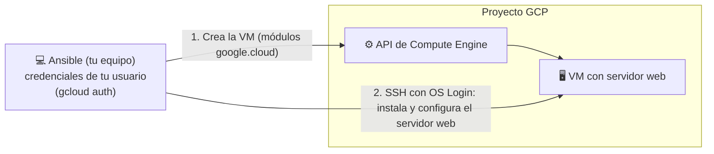

## Introducción
Ansible es una herramienta utilizada principalmente para el aprovisionamiento y la gestión de la configuración. Con la ayuda de los módulos de GCP en Ansible, podemos realizar las tareas en GCP usando Ansible.

En esta práctica vamos a realizar el aprovisionamiento de la instancia de Google VM Compute en GCP y alojamiento de un sitio web (nginx) en esta instancia creada.

## Diseño



## 1. Autenticación con tu propio usuario (sin service accounts)

No vamos a crear ninguna service account ni a descargar claves `.json`: Ansible usará
las credenciales de **tu propio usuario** de Google, igual que hacemos con Terraform.

```shell
gcloud auth login                         # para los comandos gcloud
gcloud auth application-default login     # credenciales que usarán los módulos de Ansible
gcloud config set project <tu-proyecto>
gcloud config set compute/region europe-west1
gcloud config set compute/zone europe-west1-b
```

En los módulos de `google.cloud` esto se indica con `auth_kind: application`, que usa
las credenciales generadas por `gcloud auth application-default login`.

## 2. Acceso SSH a la VM con OS Login

Para que Ansible pueda entrar por SSH en la VM que cree, usaremos **OS Login** con tu
propio usuario. Necesitarás, en este orden:

1. Activar OS Login a nivel de proyecto mediante metadata
   (`gcloud compute project-info add-metadata --metadata enable-oslogin=TRUE`).
2. Generar un par de claves SSH (`ssh-keygen`) y asociar la clave pública a tu usuario
   mediante el comando de OS Login correspondiente (`gcloud compute os-login ssh-keys add ...`).
3. Averiguar el nombre de usuario POSIX que OS Login te ha asignado (lo necesitarás para
   que Ansible se conecte por SSH):
   ```shell
   gcloud compute os-login describe-profile --format='value(posixAccounts[0].username)'
   ```
4. Comprobar que todo lo anterior está correctamente configurado (`gcloud config list`).

## 3. Revisión de la plantilla que vamos a lanzar

Los módulos de GCP para Ansible viven en la colección `google.cloud`, que no viene
instalada por defecto. Instálala antes de nada, junto con las librerías de Python que
usa para hablar con la API de Google:

```shell
ansible-galaxy collection install google.cloud
pip install google-auth requests
```

La plantilla está en la carpeta [`ansible`](./ansible) de esta práctica:
```shell
$ tree ansible
ansible
├── ansible.cfg
├── main.yml
└── roles
    └── simple-web
        ├── files
        │   └── index.html
        └── tasks
            └── main.yml

4 directories, 4 files
```

- **`ansible.cfg`**: configuración de Ansible. Desactiva la comprobación de la huella SSH
  (`host_key_checking`), ya que la VM es nueva en cada despliegue.

- **`main.yml`** (playbook principal), con dos *plays*:
  1. Un primer *play* sobre `localhost` que crea una regla de firewall para SSH y HTTP
     (módulo `google.cloud.gcp_compute_firewall`) y una instancia de Compute Engine
     (módulo `google.cloud.gcp_compute_instance`), con disco de arranque Ubuntu 24.04 LTS,
     red por defecto con IP pública, y las `tags` a las que se aplica la regla de
     firewall. A continuación, espera a que la VM esté en estado `RUNNING` (módulo
     `google.cloud.gcp_compute_instance_info` con `until`/`retries`/`delay`) y guarda su
     IP pública como host para el siguiente *play* (`add_host`).
  2. Un segundo *play* sobre el grupo de hosts anterior, que espera a que la VM acepte
     SSH y aplica el rol `simple-web`.

- **`roles/simple-web/tasks/main.yml`**: tareas para instalar `nginx` (módulo `apt`),
  copiar la página web y asegurar que el servicio está arrancado y habilitado.

- **`roles/simple-web/files/index.html`**: la página de bienvenida.

Las variables que conviene cambiar (proyecto, región/zona, tipo de máquina, imagen,
nombre de la VM...) están parametrizadas al principio del primer *play*, para no tener
que tocar el resto del fichero cuando cambien. Todas las tareas de GCP usan
`auth_kind: application`, es decir, las credenciales de tu usuario.

## 4. Ejecutando el Ansible
El paso final es ejecutar el playbook contra tu proyecto desde la carpeta `ansible`,
conectándote por SSH con tu usuario POSIX de OS Login (paso 2) y tu clave privada:

```shell
cd ansible
ansible-playbook main.yml -e gcp_project=<tu-proyecto> \
  -u <usuario_posix> --private-key ~/.ssh/<tu_clave>
```

El rol instala paquetes con `sudo` (`become: true`), así que tu usuario necesita el rol
*Compute OS Admin Login* en el proyecto (el propietario del proyecto ya lo tiene).

Si el comando falla, revisa que tengas instaladas las librerías de Python que usa
Ansible para los módulos de GCP (`google-auth`, `requests`) y que hayas hecho
`gcloud auth application-default login`.


## ENTREGA: subir la carpeta "ansible"
Lanza la plantilla en tu proyecto, personaliza la página web (`index.html`) y adjunta
evidencias de que funciona.

Vuestro profesor, para corregir, se va a descargar la entrega que hagáis en moodle. En
ella tendrá que existir la estructura de carpetas anterior metida en una carpeta
"ansible". Para la validación lanzará algo de este estilo sobre un proyecto ya creado
donde se habrá activado OS Login y se habrá hecho `gcloud auth application-default login`
con un usuario del proyecto:

```shell
ansible-playbook main.yml -e gcp_project=<proyecto> -u <usuario_posix> --private-key <clave>
```

## Resultado esperado
Al abrir la IP pública de la VM desde la consola de GCP, deberías ver que tu sitio web está implementado en la VM, desplegado íntegramente con Ansible.
