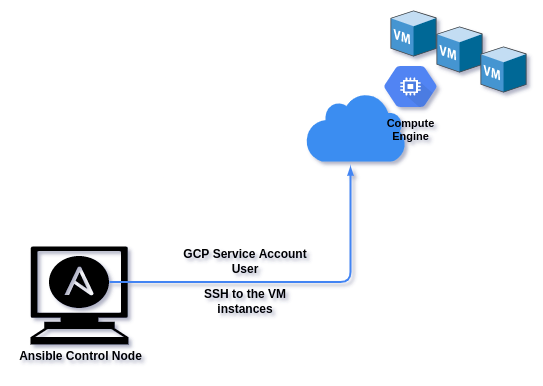
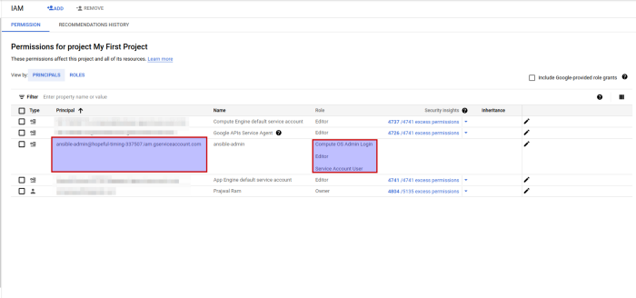
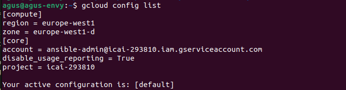

## Introducción
Ansible es una herramienta utilizada principalmente para el aprovisionamiento y la gestión de la configuración. Con la ayuda de los módulos de GCP en Ansible, podemos realizar las tareas en GCP usando Ansible.

En esta práctica vamos a realizar el aprovisionamiento de la instancia de Google VM Compute en GCP y alojamiento de un sitio web (apache) en esta instancia creada.

## Diseño



## 1. Creación Service Account y descargue las claves (.json)
Es necesario crear una Service Account en GCP y darle permisos, para que posteriormente esta sea usada por Ansible para realizar los despliegues y configuraciones.
Las Service Account se utilizan para la autenticación entre software - software (aplicación - aplicación). En nuestro caso (GCP — Ansible)
Habrá que seguir la regla del mínimo privilegio, por lo que se darán estos permisos:


#### Dar el nombre y los permisos a la Service Account



```
name = ansible-admin
Roles= Compute OS Admin Login, Compute Admin, Service Account user
```
#### Descargar las claves (archivo .json)

Después de crear la SA, descarga una key en local, ya que usaremos este fichero que contiene la key más adelante.

```
Create new key -> Download JSON file
```

## 2. Asociar una clave SSH a la SA que hemos creado

Necesitarás, en este orden:

1. Autenticarte con tu usuario normal (`gcloud init`) y activar OS-Login a nivel de
   proyecto mediante metadata.
2. Autenticarte como la Service Account creada en el paso anterior, usando el fichero
   `.json` descargado.
3. Generar un par de claves SSH específico para esta SA (`ssh-keygen`) y asociarlo a la
   Service Account mediante el comando de OS-Login correspondiente.
4. Configurar la región y zona por defecto de tu proyecto.
5. Comprobar que todo lo anterior está correctamente configurado.




## 3. Revisión de la plantilla que vamos a lanzar

Los módulos de GCP para Ansible viven en la colección `google.cloud`, que no viene
instalada por defecto. Instálala antes de nada:

```shell
ansible-galaxy collection install google.cloud
pip install google-auth
```

Estructura del directorio del proyecto que deberás preparar:
```shell
$ tree
.
├── main.yml
└── roles
    └── simple-web
        ├── files
        │   └── index.html
        └── tasks
            └── main.yml

4 directories, 3 file
```

Deberás crear el playbook de Ansible con, al menos:

- **`main.yml`** (playbook principal), con dos *plays*:
  1. Un primer *play* sobre `localhost` que cree una instancia de Compute Engine en GCP
     (módulo `google.cloud.gcp_compute_instance`), con disco de arranque, imagen a tu elección, red por
     defecto con IP pública, y las `tags` necesarias para permitir tráfico HTTP/HTTPS y
     SSH externo. A continuación, debe esperar a que la VM esté en estado `RUNNING`
     (módulo `google.cloud.gcp_compute_instance_info` con `until`/`retries`/`delay`) y guardar su IP
     pública como host para el siguiente *play* (`add_host`).
  2. Un segundo *play* sobre el grupo de hosts anterior, que aplique el rol
     `simple-web` para instalar y arrancar un servidor web con una página propia.

- **`roles/simple-web/tasks/main.yml`**: tareas para instalar el paquete del servidor web
  (usa el módulo adecuado según el sistema operativo elegido), copiar el/los fichero(s)
  de tu sitio web, y asegurar que el servicio está arrancado.

- **`roles/simple-web/files/index.html`**: tu propia página de bienvenida.

Piensa qué variables conviene parametrizar al principio del playbook (proyecto,
fichero de credenciales, región/zona, tipo de máquina, imagen...) para no tener que
tocar el resto del fichero cuando cambien.

## 4. Ejecutando el Ansible
El paso final para resumir todo el código es ejecutar el playbook de ansible contra tu
proyecto, autenticándote con el UID de la Service Account y su clave SSH.

Para el UID de la SA -> Consola de GCP -> IAM -> Service Accounts -> Haga clic en la SA que creó y ahí tiene que aparecer el id de la SA.
También se puede abrir el fichero de texto y vendrá ahí.

Si el comando falla, revisa que tengas instaladas las librerías de Python que usa
Ansible para los módulos de GCP, y que tengas resuelta la confianza automática de hosts
SSH nuevos (parámetro `host_key_checking` en la configuración de Ansible).


## ENTREGA: subir a git la plantilla/s modificada.
¿Por qué está fallando? ¿Qué cambios habría que hacer? Modifica la plantilla de Ansible para añadir los componentes que falta.
Las preguntas son retóricas, vuestro profesor para corregir esta plantilla se va a descargar vuestra entrega que hagáis en moodle. En ella tendrá que existir la estructura de carpetas que habéis preparado metido todo en una carpeta "ansible". Para la validación lanzará algo de este estilo sobre un proyecto ya creado donde se habrá activado el os-login y se habrá creado una serviceaccount.

## Resultado esperado
Al abrir la IP pública de la VM desde la consola de GCP, deberías ver que tu sitio web está implementado en la VM, desplegado íntegramente con Ansible.
