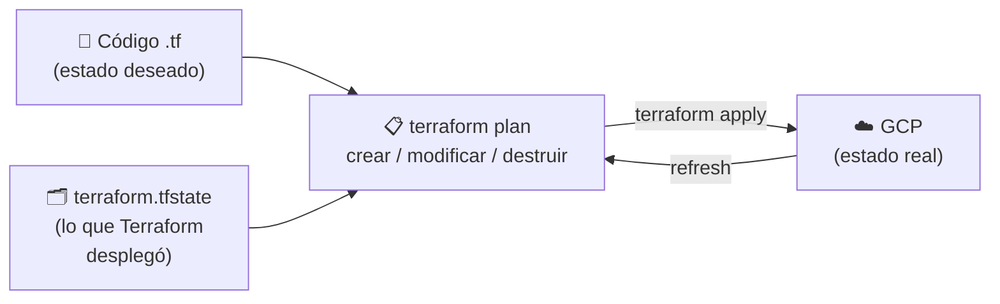

## Enfoque imperativo vs declarativo

Hasta ahora hemos desplegado la infraestructura de forma **imperativa**: una secuencia de
órdenes (`gcloud compute instances create ...`, `gcloud compute firewall-rules create ...`)
que dicen **cómo** llegar al resultado, paso a paso. Funciona, pero tiene problemas:

- Si un comando falla a mitad, el sistema queda en un estado intermedio y somos nosotros
  quienes tenemos que saber qué se creó y qué no.
- Volver a lanzar el script no es seguro: el segundo `create` falla porque el recurso ya
  existe (no es *idempotente*).
- Para cambiar algo (p.ej. el tipo de máquina) hay que escribir **otros** comandos
  distintos (`update`, `delete` + `create`...), y para limpiar, otro script (`clean.sh`).
- El script no describe el estado real: para saber qué hay desplegado hay que ir a la consola.

Con el enfoque **declarativo** describimos **qué** queremos tener (el estado final
deseado), y es la herramienta la que calcula los pasos para llegar a él:

| | Imperativo (`gcloud`, scripts bash) | Declarativo (Terraform) |
|---|---|---|
| Qué escribimos | Los pasos (**cómo**) | El resultado (**qué**) |
| Relanzar | Falla o duplica recursos | No hace nada si ya está todo como se pide (idempotente) |
| Cambios | Comandos nuevos para cada cambio | Se edita el código y se vuelve a hacer `apply` |
| Orden de creación | Lo decidimos nosotros | Lo calcula Terraform a partir de las dependencias entre recursos |
| Ver qué va a pasar | No hay | `terraform plan` |
| Limpieza | Script aparte (`clean.sh`) | `terraform destroy` |
| Fuente de verdad | La consola | El código (versionado en git) + el *state* |

Ansible está a medio camino: los *playbooks* se escriben como una lista ordenada de
tareas (imperativo), pero la mayoría de sus módulos son declarativos e idempotentes
(`state: present`). Terraform, en cambio, es declarativo de principio a fin.

## Ansible VS Terraform

Ansible hace un muy buen trabajo de aprovisionamiento y administración de la infraestructura. Pero hay herramientas como Terraform, que también hace un gran trabajo en el aprovisionamiento de infraestructura, ya que funciona con "states", por lo que es fácil de revertir la infraestructura a estados anteriores.

Por lo tanto, la forma recomendada es trabajar tanto Terraform como Ansible. Terraform para el aprovisionamiento de infraestructura y Ansible para la gestión de la configuración (instalar aplicaciones, parchear los sistemas, actualizar el software, etc.).

NO se trata de "Ansible vs Terraform" sino de "Ansible y Terraform"
