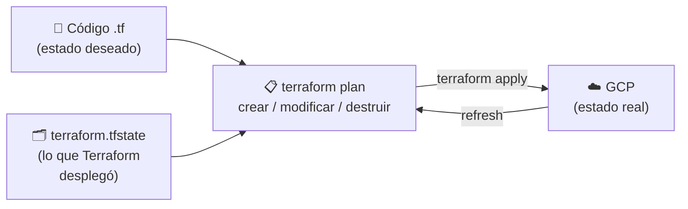

## ¿Qué es la Infraestructura como Código (IaC)?

En las prácticas anteriores hemos creado máquinas, reglas de firewall, balanceadores o
certificados haciendo clics en la consola o lanzando comandos `gcloud` a mano. La
**Infraestructura como Código** (*Infrastructure as Code*, IaC) consiste en describir
esa infraestructura en **ficheros de texto** que una herramienta lee para crearla,
modificarla o destruirla de forma automática. La infraestructura pasa a tratarse igual
que el código de una aplicación.

¿Qué ganamos?

- **Reproducibilidad**: el mismo código despliega entornos idénticos (desarrollo,
  pruebas, producción) o reconstruye todo desde cero tras un desastre, sin depender de
  la memoria de nadie ni de documentos desactualizados.
- **Control de versiones**: el código vive en git, así que sabemos quién cambió qué,
  cuándo y por qué, y podemos volver a una versión anterior.
- **Revisión y colaboración**: los cambios de infraestructura se proponen y revisan
  igual que el código (*pull requests*) antes de aplicarse.
- **Automatización**: el despliegue se puede lanzar desde un pipeline de CI/CD, sin
  pasos manuales que olvidar ni errores al teclear.
- **Documentación viva**: el código *es* la descripción exacta de lo que hay desplegado.
- **Coste y limpieza**: igual de fácil es crear todo que destruirlo, así que no se
  quedan recursos olvidados consumiendo créditos.

Hay muchas herramientas de IaC. Unas están pensadas sobre todo para **aprovisionar
infraestructura** (crear redes, VMs, balanceadores...): Terraform (y su *fork* libre
OpenTofu), Pulumi, o las propias de cada nube (AWS CloudFormation, Azure Bicep/ARM,
Google Infrastructure Manager). Otras, para la **gestión de la configuración** (instalar
y configurar el software dentro de las máquinas), como Chef, Puppet o Salt. En esta
práctica trabajaremos con **Terraform**.

## Enfoque imperativo vs declarativo

Hasta ahora hemos desplegado la infraestructura de forma **imperativa**: una secuencia de
órdenes (`gcloud compute instances create ...`, `gcloud compute firewall-rules create ...`)
que dicen **cómo** llegar al resultado, paso a paso. Funciona, pero tiene problemas:

- Si un comando falla a mitad, el sistema queda en un estado intermedio y somos nosotros
  quienes tenemos que saber qué se creó y qué no.
- Volver a lanzar el script no es seguro: el segundo `create` falla porque el recurso ya
  existe (no es *idempotente*).
- Para cambiar algo (p.ej. el tipo de máquina) hay que escribir **otros** comandos
  distintos (`update`, `delete` + `create`...), y para limpiar, otro script (`clean.sh`).
- El script no describe el estado real: para saber qué hay desplegado hay que ir a la consola.

Con el enfoque **declarativo** describimos **qué** queremos tener (el estado final
deseado), y es la herramienta la que calcula los pasos para llegar a él:

| | Imperativo (`gcloud`, scripts bash) | Declarativo (Terraform) |
|---|---|---|
| Qué escribimos | Los pasos (**cómo**) | El resultado (**qué**) |
| Relanzar | Falla o duplica recursos | No hace nada si ya está todo como se pide (idempotente) |
| Cambios | Comandos nuevos para cada cambio | Se edita el código y se vuelve a hacer `apply` |
| Orden de creación | Lo decidimos nosotros | Lo calcula Terraform a partir de las dependencias entre recursos |
| Ver qué va a pasar | No hay | `terraform plan` |
| Limpieza | Script aparte (`clean.sh`) | `terraform destroy` |
| Fuente de verdad | La consola | El código (versionado en git) + el *state* |

## Práctica opcional: Ansible

[Ansible](https://www.ansible.com/) es otra herramienta de IaC, orientada sobre todo a la
**gestión de la configuración**: instalar aplicaciones, parchear los sistemas o actualizar
el software de máquinas que ya existen, aunque también puede crear infraestructura. Está a
medio camino entre los dos enfoques: los *playbooks* son una lista ordenada de tareas
(imperativo), pero la mayoría de sus módulos son declarativos e idempotentes
(`state: present`). Lo habitual en la industria no es elegir entre Ansible o Terraform,
sino combinarlos: Terraform para aprovisionar la infraestructura y Ansible para configurar
lo que corre dentro. La práctica [02-Ansible (opcional)](./02-Ansible%20%28opcional%29/README.md)
permite comprobarlo de primera mano.
